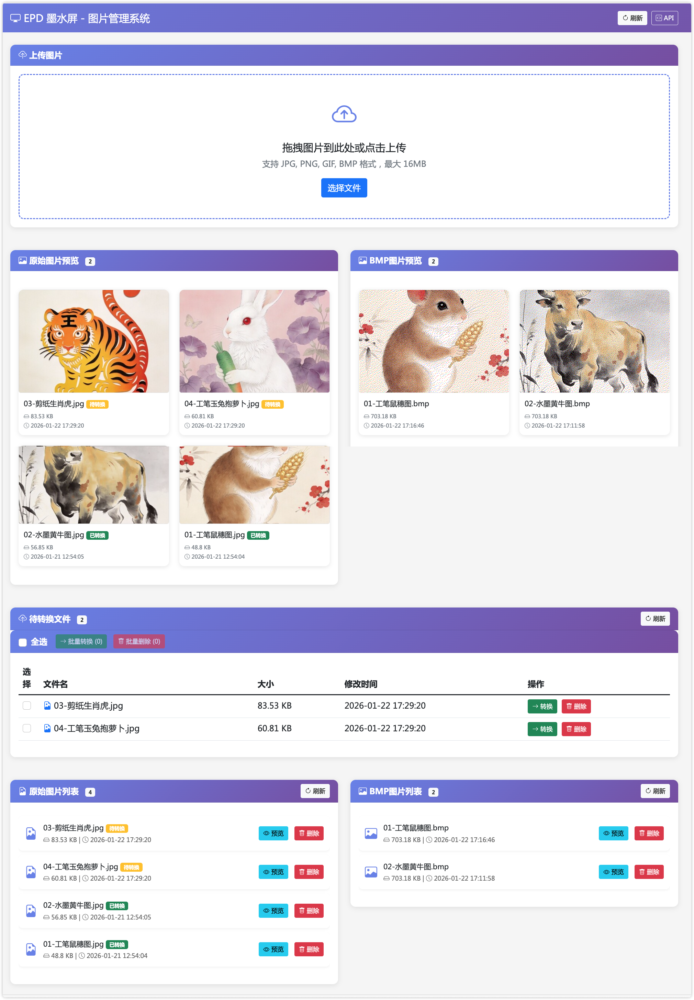

# E-Paper 相册项目

基于涂鸦 T5 平台的 E-Paper 电子纸显示屏网络相册系统，支持 WiFi 无线传输图片并远程更新显示内容。

## 📁 项目结构

```
e-Paper-Album/
├── server/          # 服务端（Python）
│   ├── manage.py                # 统一管理入口
│   ├── web_server.py           # Web 管理界面
│   ├── epd_socket_server.py    # Socket 服务器
│   ├── epd_socket_client.py   # 测试客户端
│   └── README.md              # 服务端详细说明
│
├── src/             # 硬件端（Tuya T5 嵌入式）
│   ├── main.c                   # 程序入口
│   ├── EPD_Album.c             # 网络相册核心功能
│   ├── EPD_4in0e_test.c        # 基础测试
│   ├── EPD_4in0e_test_Fast.c   # 优化版测试
│   ├── ImageData.h             # 图片数据定义
│   ├── EPD_Config.h            # EPD 配置
│   └── EPD_Test.h              # 测试接口
│
├── lib/             # 硬件端库文件
│   ├── Config/      # 驱动配置
│   ├── GUI/         # 图形界面库
│   ├── e-Paper/     # 墨水屏驱动
│   └── Fonts/       # 字体库
│
├── CMakeLists.txt   # CMake 构建配置
├── requirements.txt # Python 依赖
└── app_default.config # 应用配置
```

## 🚀 快速开始

### 1. 服务端部署（电脑端）

#### 安装依赖
```bash
cd server
pip install -r requirements.txt
```

#### 启动服务
```bash
# 启动所有服务（推荐）
python manage.py --mode all --image-dir ./dist/data

# 仅启动 Web 管理界面
python manage.py --mode web
```

#### 访问 Web 界面
打开浏览器访问：**http://localhost:5000**

- 上传图片（JPG、PNG、BMP、GIF）
- 自动转换为 BMP 格式
- 管理图片列表
- 实时查看转换进度



### 2. 硬件端部署（T5 开发板）

#### 编译固件
```bash
tos config choice
tos build
tos flash
tos monitor
```

#### 配置 WiFi 和服务器地址
编辑 `src/EPD_Album.c`：
```c
#define WIFI_SSID     "你的WiFi名称"
#define WIFI_PASSWORD "你的WiFi密码"
#define SOCKET_SERVER_IP   "192.168.1.100"  // 电脑IP地址
#define SOCKET_SERVER_PORT 18888            // Socket服务端口
```

#### 烧录运行
- 将固件烧录到 T5 开发板
- 重启设备
- 查看串口日志确认连接状态

#### 显示效果
server/static/img/tiger.jpg


## 💡 功能特性

### 服务端
- **Web 管理界面**：图片上传、预览、管理
- **Socket 服务器**：提供 TCP 网络接口
- **文件监控**：自动检测图片变化（5秒防抖）
- **图片转换**：支持多种格式转换为 BMP
- **图片排序**：支持数字文件名排序

### 硬件端
- **WiFi 连接**：自动连接指定 WiFi 网络
- **Socket 通信**：与服务器保持 TCP 连接
- **图片显示**：支持 400×600 像素 6 色显示
- **自动轮播**：每 3 分钟自动切换下一张图片
- **断线重连**：网络异常后自动重连

## 📊 系统架构

```
┌─────────────────┐
│   Web 浏览器     │──┐
└─────────────────┘  │
                     │ HTTP (5000)
┌─────────────────┐  │
│  web_server.py  │  │
└─────────────────┘  │
         │
┌─────────────────┐  │
│  manage.py      │──┘
└─────────────────┘
         │
         │ TCP (18888)
         │
    ┌───────────┐
    │ T5 开发板  │
    │(E-Paper)  │
    └───────────┘
         │
    ┌───────────┐
    │  WiFi    │
    └───────────┘
```

## 🔧 主要配置

### WiFi 配置
- **文件**：`src/EPD_Album.c`
- **宏定义**：`WIFI_SSID`、`WIFI_PASSWORD`

### Socket 配置
- **文件**：`src/EPD_Album.c`
- **服务器地址**：`SOCKET_SERVER_IP`
- **端口**：`SOCKET_SERVER_PORT`（默认 18888）

### 图片轮播
- **文件**：`src/EPD_Album.c`
- **轮播间隔**：`LOOP_INTERVAL_MS`（默认 180000ms = 3分钟）

## 📝 Socket 命令

硬件端支持的 Socket 命令：

| 命令 | 功能 | 返回 |
|------|------|------|
| `update` | 获取下一张图片并切换 | 图片信息 + 数据 |
| `info` | 获取当前图片信息 | 图片详情（不切换） |
| `get` | 获取当前图片二进制数据 | BMP 格式数据 |
| `get_c` | 获取 C 数组格式数据 | C 代码数组 |
| `list` | 获取图片列表 | 所有图片文件列表 |

## 🐛 测试验证

### 测试 Socket 连接
```bash
# 在 server 目录下
python epd_socket_client.py update
python epd_socket_client.py list
python epd_socket_client.py get_c
```

### 监控日志
- **服务端日志**：查看控制台输出
- **硬件端日志**：查看串口调试输出

## ⚠️ 注意事项

1. **网络连通性**：确保 T5 开发板和电脑在同一局域网
2. **防火墙**：开放 18888 端口（Socket）和 5000 端口（Web）
3. **图片格式**：建议使用 400×600 像素 BMP 格式
4. **图片大小**：单张图片不超过 120KB（400×600×6色/2）
5. **文件名**：建议使用数字前缀（如 `01_xxx.bmp`）便于排序

## 📄 许可证

本项目基于 [LICENSE](LICENSE) 文件中的条款发布。

## 🤝 技术支持

如有问题，请查看：
- `server/README.md` - 服务端详细文档
- `src/EPD_Config.h` - 硬件端测试接口
- 控制台日志输出

## 相关链接
- [基于涂鸦T5的智能生肖相册墨水屏 - 嘉立创开源硬件](https://oshwhub.com/honestqiao/tuya-e-paper-album)