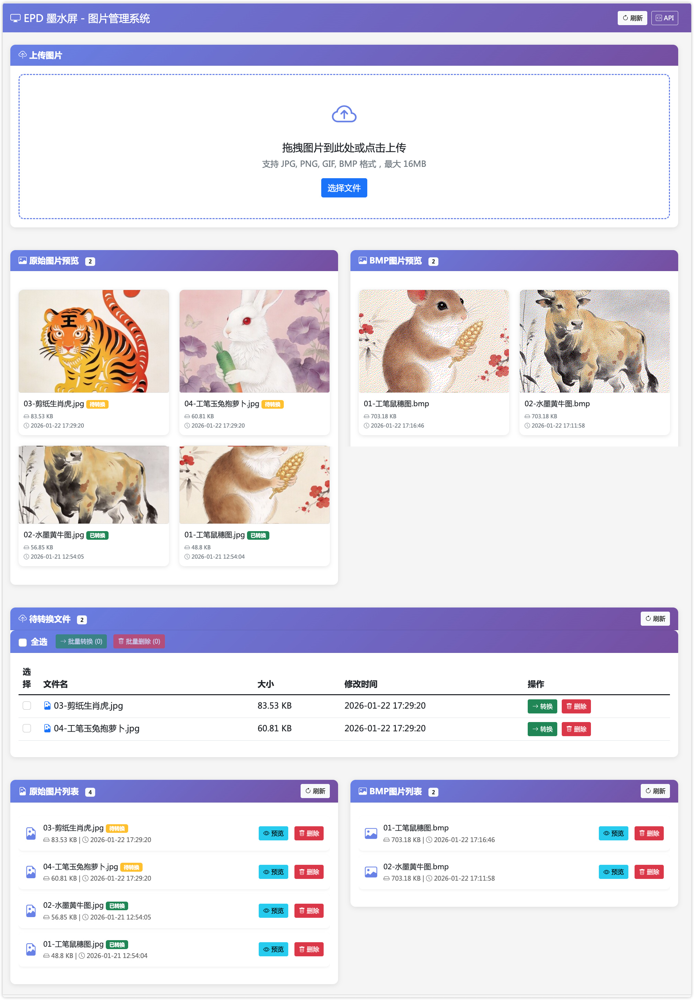
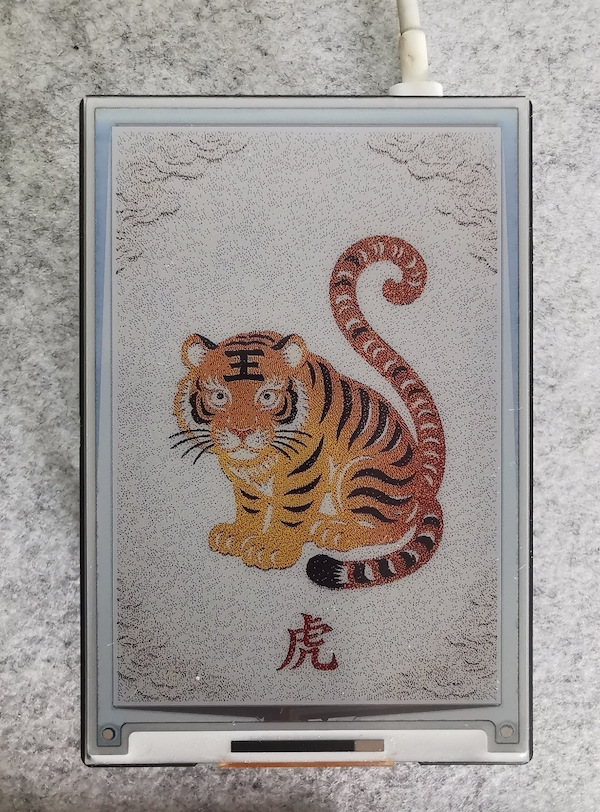
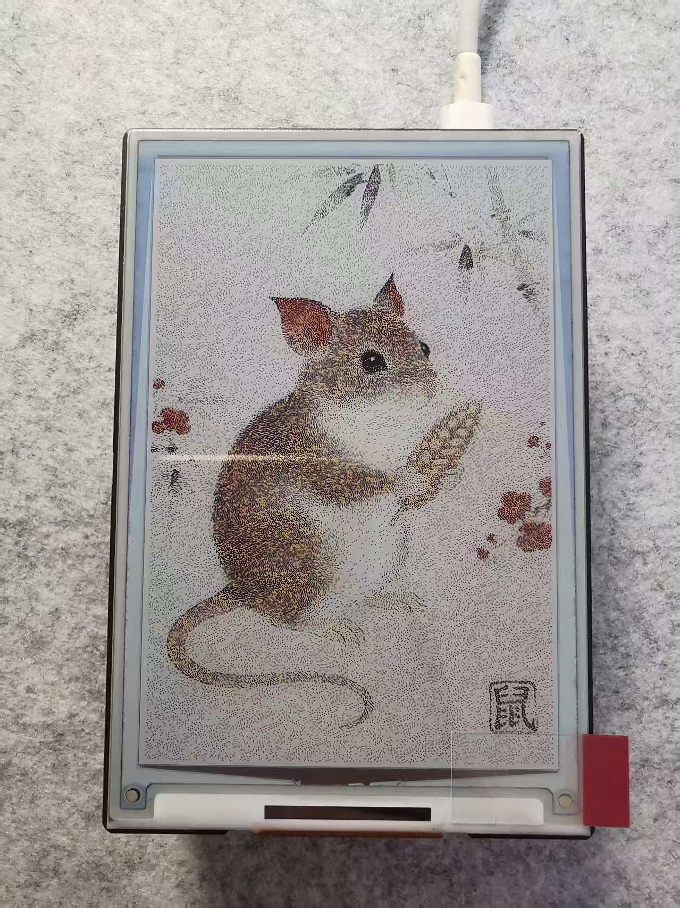

# E-Paper Album Project

Network photo album system for E-Paper displays based on the Tuya T5 platform. Supports WiFi wireless image transmission and remote content updates.

## 📁 Project Structure

```
e-Paper-Album/
├── server/          # Server side (Python)
│   ├── manage.py                # Unified management entry point
│   ├── web_server.py           # Web management interface
│   ├── epd_socket_server.py    # Socket server
│   ├── epd_socket_client.py   # Test client
│   └── README.md              # Detailed server documentation
│
├── src/             # Hardware side (Tuya T5 Embedded)
│   ├── main.c                   # Program entry point
│   ├── EPD_Album.c             # Network album core functionality
│   ├── EPD_4in0e_test.c        # Basic tests
│   ├── EPD_4in0e_test_Fast.c   # Optimized tests
│   ├── ImageData.h             # Image data definitions
│   ├── EPD_Config.h            # EPD configuration
│   └── EPD_Test.h              # Test interfaces
│
├── lib/             # Hardware libraries
│   ├── Config/      # Driver configuration
│   ├── GUI/         # Graphics interface library
│   ├── e-Paper/     # E-Paper driver
│   └── Fonts/       # Font libraries
│
├── CMakeLists.txt   # CMake build configuration
├── requirements.txt # Python dependencies
└── app_default.config # Application configuration
```

## 🚀 Quick Start

### 1. Server Deployment (Computer Side)

#### Install Dependencies
```bash
cd server
pip install -r requirements.txt
```

#### Start Services
```bash
# Start all services (recommended)
python manage.py --mode all --image-dir ./dist/data

# Start Web management interface only
python manage.py --mode web
```

#### Access Web Interface
Open browser and visit: **http://localhost:5000**

- Upload images (JPG, PNG, BMP, GIF)
- Automatic conversion to BMP format
- Manage image lists
- Real-time conversion progress



### 2. Hardware Deployment (T5 Development Board)

#### Build Firmware
```bash
tos config choice
tos build
tos flash
tos monitor
```

#### Configure WiFi and Server Address
Edit `src/EPD_Album.c`:
```c
#define WIFI_SSID     "Your_WiFi_SSID"
#define WIFI_PASSWORD "Your_WiFi_Password"
#define SOCKET_SERVER_IP   "192.168.1.100"  // Computer IP address
#define SOCKET_SERVER_PORT 18888            // Socket service port
```

#### Flash and Run
- Flash firmware to T5 development board
- Restart device
- Check serial debug logs for connection status

#### Display Effect
server/static/img/tiger.jpg


## 💡 Features

### Server Side
- **Web Management Interface**: Image upload, preview, and management
- **Socket Server**: Provides TCP network interface
- **File Monitoring**: Auto-detect image changes (5-second debounce)
- **Image Conversion**: Supports multiple formats to BMP conversion
- **Image Sorting**: Supports numeric filename sorting

### Hardware Side
- **WiFi Connection**: Auto-connect to specified WiFi network
- **Socket Communication**: Maintain TCP connection with server
- **Image Display**: Supports 400×600 pixel 6-color display
- **Auto Slideshow**: Auto-switch to next image every 3 minutes
- **Auto Reconnect**: Automatically reconnect after network failures

## 📊 System Architecture

```
┌─────────────────┐
│   Web Browser   │──┐
└─────────────────┘  │
                     │ HTTP (5000)
┌─────────────────┐  │
│  web_server.py  │  │
└─────────────────┘  │
         │           │
┌─────────────────┐  │
│  manage.py      │──┘
└─────────────────┘
         │
         │ TCP (18888)
         │
    ┌───────────┐
    │ T5 Board  │
    │(E-Paper)  │
    └───────────┘
         │
    ┌───────────┐
    │   WiFi    │
    └───────────┘
```

## 🔧 Main Configuration

### WiFi Configuration
- **File**: `src/EPD_Album.c`
- **Macros**: `WIFI_SSID`, `WIFI_PASSWORD`

### Socket Configuration
- **File**: `src/EPD_Album.c`
- **Server Address**: `SOCKET_SERVER_IP`
- **Port**: `SOCKET_SERVER_PORT` (default 18888)

### Slideshow Settings
- **File**: `src/EPD_Album.c`
- **Interval**: `LOOP_INTERVAL_MS` (default 180000ms = 3 minutes)

## 📝 Socket Commands

Socket commands supported by the hardware side:

| Command | Function | Returns |
|---------|----------|---------|
| `update` | Get next image and switch | Image info + data |
| `info` | Get current image info | Image details (no switch) |
| `get` | Get current image binary data | BMP format data |
| `get_c` | Get C array format data | C code array |
| `list` | Get image list | All image file list |

## 🐛 Testing and Verification

### Test Socket Connection
```bash
# In server directory
python epd_socket_client.py update
python epd_socket_client.py list
python epd_socket_client.py get_c
```

### Monitor Logs
- **Server logs**: Check console output
- **Hardware logs**: Check serial debug output

## ⚠️ Important Notes

1. **Network Connectivity**: Ensure T5 board and computer are on the same LAN
2. **Firewall**: Open port 18888 (Socket) and port 5000 (Web)
3. **Image Format**: Recommended 400×600 pixel BMP format
4. **Image Size**: Single image should not exceed 120KB (400×600×6 colors/2)
5. **Filename**: Recommended numeric prefix (e.g., `01_xxx.bmp`) for easy sorting

## 📄 License

This project is released under the terms specified in the [LICENSE](LICENSE) file.

## 🤝 Technical Support

For questions, please refer to:
- `server/README.md` - Detailed server documentation
- `src/EPD_Config.h` - Hardware test interfaces
- Console log output

## Related Links
- [Tuya T5 Based Smart Zodiac E-Paper Album - Oshwhub Open Source Hardware](https://oshwhub.com/article/tuya-e-paper-album)
